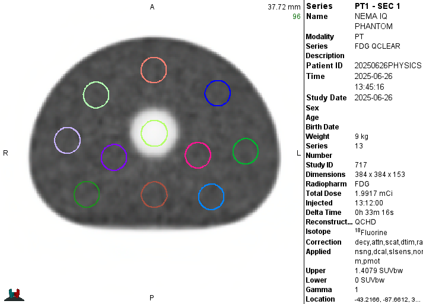
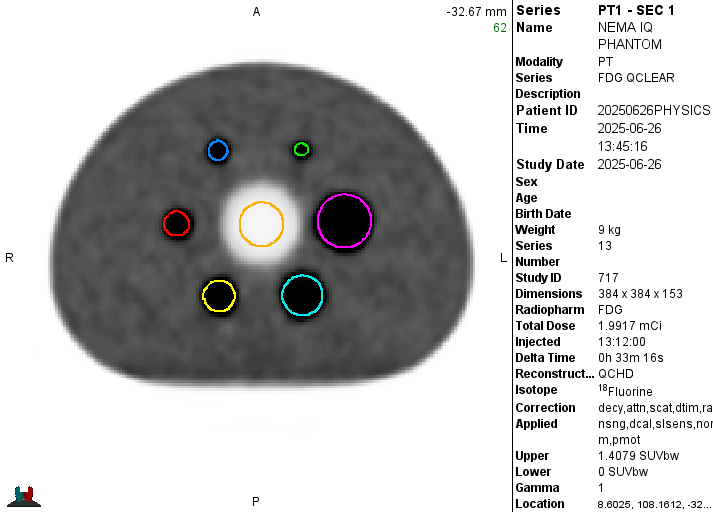
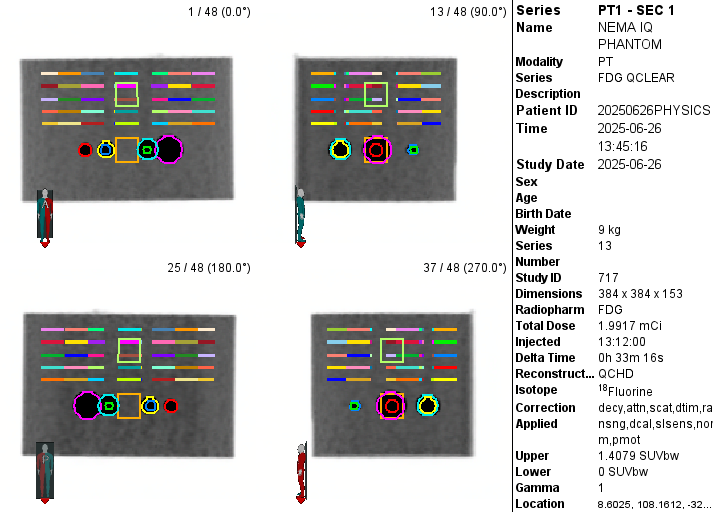

```{r}
#| label: load data
#| include: false

# libraries ---------------------------------------------------------------

library(tidyverse)
library(paletteer)

# load data ---------------------------------------------------------------

omni_phantom_data_filename <- r"(data/20250626_NEMA_IQ_Stats_2.csv)"
omni_phantom_df <- read.csv(omni_phantom_data_filename) |>
  select(-seriestime) |> 
  filter(grepl("150",seriesdesc))

dmi_phantom_df <- read_csv("data/harm_contour_stats_DMI-2025-06-26.csv")|>
  select(-seriestime) |> 
  filter(grepl(" AC", seriesdesc)) |> 
  filter(!grepl("00", contourname))

```

We scanned a NEMA IQ phantom back to back on the DMI and Omni. The phantom was filled with a 4:1 sphere to background ratio. The acquisition was 10 minutes long on each scanner and then reconstructed as shorter time-points. This analysis compares the 150 second duration scans. The Omni was reconstructed with OSEM, QClear as well as the machine learning options (MPDL and HPDL). The DMI has ToF and QClear reconstructions.

I drew spherical ROIs on the CT and used MIM to copy them to each PET and export SUV statistics (mean, max, min, peak).

```{r}
#| label: process sphere data
#| include: false
omni_spheres <- omni_phantom_df |> filter(grepl("^sph",contourname,ignore.case = T))
dmi_spheres <- dmi_phantom_df |> filter(grepl("^sph",contourname,ignore.case = T))

sphere_data <- bind_rows(omni = omni_spheres,dmi = dmi_spheres, .id = "scanner") |> 
  mutate(seriesdesc = case_when(
    seriesdesc == "150s FDG AC" ~ "OSEM",
    seriesdesc == "150s FDG Qclear" ~ "QClear",
    seriesdesc == "150s FDG Qclear - HPDL" ~ "Qclear HPDL",
    seriesdesc == "150s FDG Qclear - MPDL" ~ "Qclear MPDL",
    seriesdesc == "150s TOF AC" ~ "ToF OSEM",
    seriesdesc == "150s QClear AC" ~ "QClear"
  )) |> 
  mutate(cov = stdev/suvmean,
         sph_dia = str_match(contourname,pattern = "(\\d\\d)mm") |> 
           as_tibble() |> 
           select(2) |> 
           pull() |> 
           parse_number()
         ) |> 
  pivot_longer(
    cols = starts_with("suv",ignore.case = T) | stdev | cov, 
    names_to = "measure")

```

Figure 1: Comparison of SUV metrics between scanners

```{r}
#| label: Sphere SUV plot
#| echo: false
# Plots comparing SUV measures
sphere_suv_facets <- sphere_data |> 
  filter(grepl("suv",measure)) |> 
  ggplot(aes(x = sph_dia, y = value,color = seriesdesc)) +
  geom_line(aes(linetype = scanner),linewidth = 1) +
  geom_point(size = 2) +
  geom_hline(aes(yintercept = 4)) +
<<<<<<< HEAD
  scale_y_continuous(expand = c(0,0), limits = c(0,NA)) +
=======
>>>>>>> fc3036e04aef0c547787b95505b40154cc7a3921
  scale_x_continuous(breaks = c(10,13,17,22,28,37), minor_breaks = NULL) +
  scale_color_paletteer_d("lisa::GustavKlimt") +
  labs(
    x = "Sphere Diameter",
    y = "SUV",
    title = "SUV measure comparison for Omni & DMI",
    subtitle = "NEMA IQ Phantom - Scan duration 150s",
    color = "Reconstruction Type",
    linetype = "Scanner"
  ) +
  facet_wrap(~measure) +
  theme_light()
sphere_suv_facets
```

Figure 2: Standard Deviation in sphere ROI (SUV)

```{r}
#| label: Sphere standard deviation plot
#| echo: false
# stdev plot
sphere_data |> 
  filter(measure == "stdev") |>   
  ggplot(aes(x = volume, y = value,color = seriesdesc)) +
  geom_line(aes(linetype = scanner),linewidth = 1) +
  geom_point(size = 2) +
  scale_y_continuous(breaks = seq(0.2,1,0.2)) +
  scale_color_paletteer_d("lisa::GustavKlimt") +
  labs(
    x = "Sphere Volume",
    y = "Standard Deviation",
    title = "St. dev. in SUV for Omni & DMI",
    subtitle = "NEMA IQ Phantom - Scan duration 150s",
    color = "Reconstruction Type",
    linetype = "Scanner"
  )+
  theme_light()
```

The background region of the phantom had 30mm diameter circular ROIs drawn. 10 ROIs were spaced evenly on 5 slices totaling 50 ROIs

```{r}
#| label: process bkg data
#| include: false
bg_data <- bind_rows(
  omni = omni_phantom_df,
  dmi = dmi_phantom_df, 
  .id = "scanner"
)|>
  filter(grepl("^Bkg",contourname)) |>
  separate_wider_regex(
    contourname,
    c(".+",cyl_index = "\\d{2}","-",slice_index ="0\\d")  #Extract location identifiers in case we want to know individual locations of bkg rois
  ) |> 
  mutate(
    cyl_index = as.integer(cyl_index),
    slice_index = as.integer(slice_index),
    type = case_when( #Extract more filterable recon type distinction from series description
      str_detect(seriesdesc,"FDG AC") ~ "OSEM",
      str_detect(seriesdesc,"HPDL")   ~ "QClear HPDL",
      str_detect(seriesdesc,"MPDL")   ~ "QClear MPDL",
      str_detect(seriesdesc,"TOF")    ~ "ToF OSEM",
      .default = "QCLEAR"
    )
  )  |> 
  select(-rows,-fov,-voxelsize,-suvpeak,-seriesdesc,-afd) |> 
  relocate(type)
```

Table 1: Summary of noise metrics

```{r}
#| label: Bkg Noise Summary
#| echo: false
#| message: false
#| warning: false
noise_metrics <- bg_data |> 
  group_by(scanner,type) |> 
  reframe(
    count = n(),
    group_stdev = sd(suvmean),
    group_mean = mean(suvmean),
    image_roughness = mean(stdev/suvmean),
    bkg_var = group_stdev / group_mean
  ) 
knitr::kable(noise_metrics,digits = 3)
```

Figure 3: Plot of phantom background noise, with noise defined as the standard deviation in SUVmean for the 50 regions.

```{r}
#| label: Bkg Noise Plot
#| echo: false
noise_metrics |> 
  ggplot(aes(x = type, y = group_stdev, color = scanner)) +
  geom_point(size = 3) +
  scale_x_discrete() +
  scale_y_continuous(
    expand = c(0,0),
    limits = c(0, 0.03)) +
  labs(
    title = "Noise in NEMA Phantom Background",
    subtitle = "Noise is defined as stdev in SUVmean between 50 Bkg ROIs",
    x = "Reconstruction Type",
    y = "Noise",
    color = "Scanner",
  )+
  theme_light()
```

## Supplemental 

Screenshots showing the locations of the ROIs







### Zoom-in of metrics from first comparison

```{r}
#| label: SUV charts individual
#| echo: false

sphere_suv_charts <- function(suv_type){
  sphere_data |> 
    filter(grepl(suv_type,measure)) |> 
    ggplot(aes(x = sph_dia, y = value,color = seriesdesc)) +
    geom_line(aes(linetype = scanner),linewidth = 1) +
    geom_point(size = 2) +
    scale_x_continuous(breaks = c(10,13,17,22,28,37), minor_breaks = NULL) +
    scale_y_continuous(expand = c(0,0), limits = c(0,NA))+
    scale_color_paletteer_d("lisa::GustavKlimt") +
    labs(
      x = "Sphere Diameter",
      y = suv_type,
      title = paste0(suv_type," comparison for Omni & DMI"),
      subtitle = "NEMA IQ Phantom - Scan duration 150s",
      color = "Reconstruction Type",
      linetype = "Scanner"
    ) +
    theme_minimal()
}
sphere_suv_charts("suvmax")
sphere_suv_charts("suvpeak")
sphere_suv_charts("suvmean")
sphere_suv_charts("suvmin")
```
