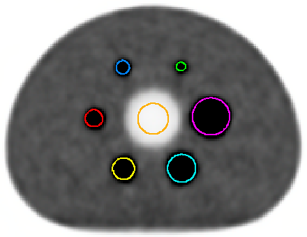
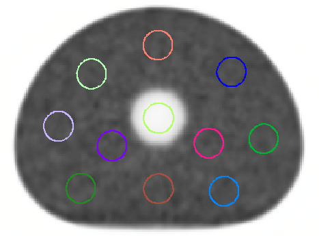

```{r}
#| label: libraries
#| include: false

library(tidyverse)
library(paletteer)
library(patchwork)
```

```{r}
#| label: data loading
#| include: false

omni_phantom_data_filename <- r"(data/harm_contour_stats_4replications_omni-2025-06-26.csv)" #file contains extracted ROI data from 4 replications per duration
dmi_phantom_data_filename <- r"(data/harm_contour_stats_DMI-2025-06-26.csv)" #file contains only 1 reconstruction per setting and fewer settings

# Read CSV into dataframe
omni_phantom_df <- read.csv(omni_phantom_data_filename) |>
  select(-seriestime) |> #redundant, all scans at same time
  filter(!grepl("00", contourname)) |> # remove groups
  filter(!(str_detect(seriesdesc,"^180") & afd == 60000)) # 2026-07-22: fourth replication of 3 minute scan had incorrect duration, filtered out

dmi_phantom_df <- read_csv(dmi_phantom_data_filename)|>
  select(-seriestime) |> #redundant, all scans at same time
  filter(grepl(" AC", seriesdesc)) |> # only AC recons (file only contains them currently anyway)
  filter(!grepl("00", contourname))  # removes group ROIs

```

```{r}
#| label: clean omni data
#| include: false

# Extract BKG ROI data and re-structure
omni_bg_df <- omni_phantom_df |> 
  filter(grepl("^Bkg",contourname)) |> # background contours for noise analysis
  separate_wider_regex(
    contourname,
    c(".+",cyl_index = "\\d{2}","-",slice_index ="0\\d")  #Extract location identifiers in case we want to know individual locations of bkg rois
  ) |> 
  mutate(
    cyl_index = as.integer(cyl_index), # convert text to number
    slice_index = as.integer(slice_index), # convert text to number
    type = case_when( #Extract more filterable recon type distinction from series description
      str_detect(seriesdesc,"AC") | str_detect(seriesdesc,"osem") ~ "OSEM",
      str_detect(seriesdesc,"HPDL") ~ "HPDL",
      str_detect(seriesdesc,"MPDL") ~ "MPDL",
      .default = "QCLEAR"),
    replication = str_extract(seriesdesc,"( \\d)",1) #pulls replication number from description
  )  |> 
  mutate(
    replication = ifelse( # initial replication had no number, so replace NA with 1
      is.na(replication),
      yes = 1,
      no = parse_number(replication)
    )
  ) |> 
  select(-rows,-fov,-voxelsize,-suvpeak,-seriesdesc) |> # remove unnecisary fields
  relocate(type)

```

```{r}
#| label: clean dmi data
#| include: false

dmi_bg_df <- dmi_phantom_df |> filter(grepl("^Bkg",contourname)) |> # background contours for noise analysis
  separate_wider_regex(
    contourname,
    c(".+",cyl_index = "\\d{2}","-",slice_index ="0\\d")  #Extract location identifiers in case we want to know individual locations of bkg rois
  ) |> 
  mutate(
    cyl_index = as.integer(cyl_index), # convert text to number
    slice_index = as.integer(slice_index), # convert text to number
    type = case_when( #Extract more filterable recon type distinction from series description
      str_detect(seriesdesc,"TOF")  ~ "Tof OSEM",
      .default = "QCLEAR"),
    replication = str_extract(seriesdesc,"( \\d)",1) #pulls replication number from description (DMI has only 1 right now)
  )  |> 
  mutate(
    replication = ifelse( # initial replication had no number, so replace NA with 1
      is.na(replication),
      yes = 1,
      no = parse_number(replication)
    )
  ) |> 
  select(-rows,-fov,-voxelsize,-suvpeak,-seriesdesc) |> # remove unnecisary fields
  relocate(type)
  
```

## Overview

We scanned a NEMA IQ phantom back to back on the DMI and Omni. The phantom was filled with a 4:1 sphere to background ratio. The acquisition was 10 minutes long on each scanner and then reconstructed as shorter time-points.

The Omni was reconstructed with OSEM, QClear as well as the machine learning options (MPDL and HPDL). The DMI has ToF and QClear reconstructions. The Omni scans were reconstructed at multiple durations (60, 90, 120, 150, 180 seconds), the DMI is only 150 seconds, the current clinical default. The Omni scans were also replicated multiple times for more robust statistics, that process has not yet been done on the DMI data.

## ROIs

ROIs were drawn on the CT, then a MIM workflow was used to copy them to the various PETs and extract SUV metrics.

1.  Six spherical ROIs drawn inside each sphere
2.  Two cylindrical ROIs in the lung insert, one near the spheres the other near the background
3.  Fifty circular ROIs in the background, 10 on 5 different slices.

::: {#fig-roi-example layout-ncol="2"}
{width="80%"}

{width="85%"}

ROI Positions
:::

## Noise Metrics

Noise (also referred to here as background variance) is the Coefficient of Variation (CoV) in the 50 background ROIs. We also evaluate Image Roughness, which is the mean of the CoV for each ROI. Both metrics are from work by Shan Tong [@Tong2010]

```{r}
#| label: omni noise metric dfs
#| echo: false

omni_noise_metrics <- omni_bg_df |> 
  group_by(replication,type,afd) |> 
  reframe(
    count = n(),
    group_stdev = sd(suvmean),
    group_mean = mean(suvmean),
    image_roughness = mean(stdev/suvmean),
    bkg_var_noise = group_stdev / group_mean
  ) 

# with replications, we can get min/max/mean of previous metrics
omni_noise_metrics_summary <- omni_noise_metrics |> 
  group_by(type,afd) |> 
  reframe(
    group_stdev_min = min(group_stdev),
    group_stdev_max = max(group_stdev),
    group_stdev_mean= mean(group_stdev),
    group_mean_mean = mean(group_mean),
    image_roughness_min = min(image_roughness),
    image_roughness_max = max(image_roughness),
    image_roughness_mean= mean(image_roughness),
    bkg_var_noise_min = min(bkg_var_noise),
    bkg_var_noise_max = max(bkg_var_noise),
    bkg_var_noise_mean= mean(bkg_var_noise)
  )

```

```{r}
#| label: dmi noise metric dfs
#| echo: false

dmi_noise_metrics <- dmi_bg_df |> 
  group_by(replication,type,afd) |> 
  reframe(
    count = n(),
    group_stdev = sd(suvmean),
    group_mean = mean(suvmean),
    image_roughness = mean(stdev/suvmean),
    bkg_var_noise = group_stdev / group_mean
  ) 

```

## Omni Noise Plots

```{r}
#| label: mean_stdev_plot_omni
#| echo: false
mean_stdev_plot_omni <- omni_noise_metrics_summary |>
  ggplot(aes(x = afd/1000, y = group_stdev_mean, color = type, shape = type)) +
  geom_point() +
  geom_line() +
  #geom_segment(aes(x= afd/1000, xend = afd/1000, y = group_stdev_min,yend = group_stdev_max,color = type),alpha=0.5)+
  scale_x_continuous(breaks = c(60,90,120,150,180), minor_breaks = NULL) +
  scale_y_continuous(expand = c(0, 0), limits = c(0, 0.03)) +
  labs(
    title = "Noise by scan type & duration",
    x = "Scan Duration (seconds)",
    y = "Noise (stdev in ROI mean)",
    color = "Reconstruction",
    shape = "Reconstruction",
    subtitle = "Mean values of replications"
  ) +
  theme_minimal()
mean_stdev_plot_omni

# plot above, but using individual replications to show spread, position dodge for legibility
noise_scatter_omni <- omni_noise_metrics |>
  ggplot(aes(x = afd/1000, y = group_stdev, color = type, shape = type)) +
  geom_point(position = position_dodge(width = 5)) +
  scale_x_continuous(breaks = c(60,90,120,150,180), minor_breaks = NULL) +
  scale_y_continuous(expand = c(0, 0), limits = c(0, 0.03)) +
  labs(
    title = "Noise by scan type & duration",
    x = "Scan Duration (seconds)",
    y = "Noise (stdev in ROI mean)",
    color = "Reconstruction",
    shape = "Reconstruction",
    subtitle = "All replications, position dodge for legibility"
  ) +
  theme_minimal()
  # + theme(plot.background = element_rect(colour = "black", fill=NA, linewidth=1))
        
# noise_scatter_omni 
```

```{r}
#| label: omni noise scatter
#| echo: false
# Mean of replications w/  error bars + facet
omni_noise_metrics |>
  ggplot(aes(x = afd/1000, y = group_stdev, color = type)) +
  geom_point(aes(shape = type)) +
  geom_line(data = omni_noise_metrics_summary,aes(x = afd/1000, y= group_stdev_mean, color = type)) +
  #geom_line(aes(y = group_stdev_min), alpha = 0.8) +
  #geom_line(aes(y = group_stdev_max), alpha = 0.8) +
  scale_x_continuous(breaks = c(60,90,120,150,180), minor_breaks = NULL) +
  scale_y_continuous(expand = c(0, 0), limits = c(0, 0.03)) +
  labs(
    title = "Noise by scan type & duration",
    x = "Scan Duration (seconds)",
    y = "Noise (stdev in ROI mean)",
    color = "Reconstruction",
    shape = "Reconstruction",
    subtitle = ""
  ) +
  theme_minimal() +
  facet_wrap(~type)

```

```{r}
#| label: image roughness mean
#| echo: false

# Image Roughness - mean between replications
omni_img_rough_plot_mean <- omni_noise_metrics_summary |> 
  ggplot(aes(x = afd/1000, y = image_roughness_mean, color = type, shape = type)) +
  geom_point() +
  geom_line() +
  #geom_smooth(se = F) +
  scale_x_continuous(breaks = c(60,90,120,150,180), minor_breaks = NULL) +
  scale_y_continuous(expand = c(0, 0), limits = c(0, 0.1)) +
  labs(
    title = "Image Roughness in ROI group by scan type/duration",
    x = "Scan Duration (seconds)",
    y = "Mean of ROI CoV",
    color = "Reconstruction",
    shape = "Reconstruction",
    subtitle = "Mean of replications"
  ) +
  theme_minimal()
omni_img_rough_plot_mean

```

```{r}
#| label: image roughness scatter
#| echo: false
# Mean of replications w/  error bars + facet
omni_noise_metrics |>
  ggplot(aes(x = afd/1000, y = image_roughness, color = type)) +
  geom_point(aes(shape = type)) +
  geom_line(data = omni_noise_metrics_summary,aes(x = afd/1000, y= image_roughness_mean, color = type)) +
  #geom_line(aes(y = group_stdev_min), alpha = 0.8) +
  #geom_line(aes(y = group_stdev_max), alpha = 0.8) +
  scale_x_continuous(breaks = c(60,90,120,150,180), minor_breaks = NULL) +
  scale_y_continuous(expand = c(0, 0), limits = c(0, 0.1)) +
  labs(
    title = "Image Roughness by scan type & duration",
    x = "Scan Duration (seconds)",
    y = "Image Roughness (Mean of ROI CoV)",
    color = "Reconstruction",
    shape = "Reconstruction",
    subtitle = ""
  ) +
  theme_minimal() +
  facet_wrap(~type)
```

## Comparison between image roughness and noise

```{r}
#| label: omni_noise_vs_roughness
#| echo: false
noise_chull_recon <- omni_noise_metrics |> group_by(type) |> slice(chull(image_roughness,group_stdev))

omni_noise_vs_roughness_recon <- omni_noise_metrics |> 
  ggplot(aes(x = image_roughness, y = group_stdev, color = type, fill=type, shape = type)) +
  geom_point() +
  geom_polygon(data = noise_chull_recon, alpha = 0.4) +
  scale_fill_viridis_d()+
  scale_color_viridis_d()+
  labs(
    title = "Noise vs Image Roughness - Reconstruction Type",
    subtitle = "Stdev of SUVmean vs mean CoV in SUVmean",
    x = "Image Roughness (mean of ROI CoV)",
    y = "Noise (Stdev of ROI means)",
    color = "Reconstruction",
    shape = "Reconstruction",
    fill  = "Reconstruction"
  ) +
  theme_minimal()

omni_noise_vs_roughness_recon
```

```{r}
#| label: omni_noise_vs_roughness_afd
#| echo: false

noise_chull_afd <- omni_noise_metrics |> 
  mutate(afd = paste0(afd/1000,"s")) |> 
  mutate(afd = factor(afd, levels = c("60s","90s","120s","150s","180s"))) |> 
  group_by(afd) |> 
  slice(chull(image_roughness,group_stdev))

omni_noise_vs_roughness_afd <- omni_noise_metrics |> 
  mutate(afd = paste0(afd/1000,"s")) |> 
  mutate(afd = factor(afd, levels = c("60s","90s","120s","150s","180s"))) |> 
  ggplot(aes(x = image_roughness, y = group_stdev, color = afd, fill = afd, shape = afd)) +
  geom_point() +
  geom_polygon(data = noise_chull_afd, alpha = 0.4) +
  scale_fill_viridis_d()+
  scale_color_viridis_d()+
  labs(
    title = "Noise vs Image Roughness - Scan Duration",
    subtitle = "Stdev of SUVmean vs mean CoV in SUVmean",
    x = "Image Roughness (mean of ROI CoV)",
    y = "Noise (Stdev of ROI means)",
    color = "Duration",
    shape = "Duration",
    fill  = "Duration"

  )+
  theme_minimal()
omni_noise_vs_roughness_afd
```
